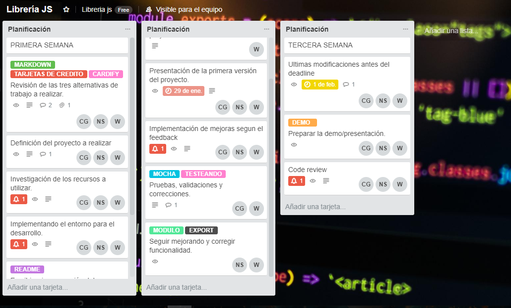

<p align="center">
	
	</img>
</p>
<p align="center">
Módulo de Node.js extrae todos los links encontrados en un string (formato Markdown).
</p>
<p align="center">
  <a href="https://badge.fury.io/js/sweetalert"></a>
  <a href="https://travis-ci.org/t4t5/sweetalert"><a>
  <a href="https://github.com/t4t5/sweetalert/blob/master/LICENSE">
    
  </a>
</p>

##  Descripción general

Este proyecto consiste en implementar un módulo de Node.js que reciba un string (en formato Markdown) y extraiga todos los links encontrados, devolviendolo en un arreglo de objetos.

## Planificación



Para mas detalles ver el siguiente link https://trello.com/b/dixHJVhT/librer%C3%ADa-js

##  Inicializando

Para usar Markdown Links, deberá descargar ... y agregarlo a su carpeta js. O bien, puede agregar esta línea de código en el encabezado o en el cuerpo de su página:
```html
//  ...

```
o puede instalar name usando [npm](https://npmjs.com/package/name)
```bash
$ npm install ...
```
## Ejemplo

Se realizo una demo usando index.js.


## Test

Usamos el framework Mocha y la librería de aserciones Chai para realizar el test.


## Autores

- **Nelida Quispe** - [@NelidaSh](https://github.com/NelidaSh)
- **Wendy Quispe** - [@wendytamara](https://github.com/wendytamara)
- **Claudia Garibotto** - [@Claudiagari](https://github.com/Claudiagari)

## Licencia

Este proyecto está licenciado bajo la Licencia ISC - ver el archivo [LICENSE](https://www.isc.org) para más detalles.

Copyright &copy; 2018 All Rights Reserved.
